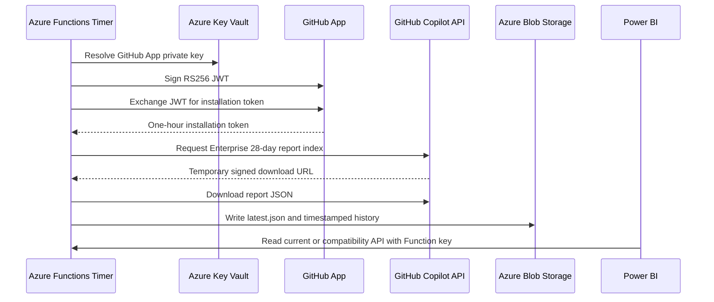

# GitHub Copilot Enterprise Metrics for Power BI on Azure Functions

Production-oriented ingestion and Power BI visualization for the current GitHub Copilot Enterprise usage metrics
reports.

This project is based on the MIT-licensed
[GitHub Copilot Metrics Viewer for Power BI](https://github.com/github-copilot-resources/copilot-metrics-viewer-power-bi).
It preserves the upstream dashboard design while adding:

- Server-to-server GitHub App authentication.
- Automatic JWT and installation-token generation.
- Download and normalization of the current signed Enterprise report format.
- Daily Azure Functions collection.
- Private Blob history.
- Key Vault integration and managed identity.
- A compatibility API that keeps the upstream Power BI visuals bound.
- Bicep, deployment scripts, tests, CI, operations guidance, and security documentation.

No subscription IDs, tenant IDs, Enterprise names, organization names, App IDs, installation IDs, credentials, or
environment URLs are committed.

## Architecture



## Why Azure Functions

A GitHub App does not provide a permanent bearer token. It provides an identity:

- App ID.
- Client ID.
- RSA private key.
- Installation ID.

A trusted process must create a short-lived App JWT, exchange it for an installation access token, call the report
API, immediately consume signed download links, validate the payload, and preserve a stable copy. Power Query is not
an appropriate place to hold a private key or implement this lifecycle.

The Function App owns authentication and ingestion. Power BI receives only prepared data.

## Function triggers

| Function | Trigger | Authentication | Purpose |
| --- | --- | --- | --- |
| `health` | HTTP GET | Anonymous | Non-sensitive health and mode |
| `metrics` | HTTP GET | Function-specific key | Native normalized `day_totals` |
| `compatibilityMetrics` | HTTP GET | Function-specific key | Legacy contract for the adapted upstream PBIP |
| `refresh` | HTTP POST | Function key | Immediate collection and Blob persistence |
| `scheduledRefresh` | Timer | Azure internal | Daily collection at 06:00 UTC |

## GitHub App setup

### 1. Create the App

Create a GitHub App owned by the appropriate corporate account.

For server-to-server metrics collection:

- Redirect/callback URI: not required.
- User authorization: not required.
- Webhooks: not required.
- Repository permissions: not required for Enterprise aggregate metrics.

### 2. Grant minimum permissions

Set the Enterprise permission:

| Permission | Access |
| --- | --- |
| Enterprise Copilot metrics | Read-only |

Add Organization Copilot metrics read-only only when organization reports are also required.

### 3. Install the App

Install the App on the target Enterprise. The installation ID appears in:

```text
https://github.com/enterprises/<ENTERPRISE>/settings/installations/<INSTALLATION_ID>
```

It can also be discovered by signing an App JWT and calling:

```text
GET https://api.github.com/app/installations
```

### 4. Generate the private key

Generate a `.pem` private key from the GitHub App settings. Never paste it into a ticket, chat, Power Query, Bicep
file, app setting, or Git repository.

The private key is uploaded directly to Key Vault after the infrastructure bootstrap.

## Configuration

### Bootstrap parameters

Copy the bootstrap example:

```bash
cp infra/bootstrap.bicepparam.example infra/bootstrap.bicepparam
```

Files ending in `.bicepparam` are ignored by Git. Files ending in `.bicepparam.example` are safe templates.

### Enterprise parameters

Copy and edit:

```bash
cp infra/enterprise.bicepparam.example infra/enterprise.bicepparam
```

Replace:

```bicep
param githubAppId = '<YOUR_GITHUB_APP_ID>'
param githubInstallationId = '<YOUR_ENTERPRISE_INSTALLATION_ID>'
param githubMetricsUrl = 'https://api.github.com/enterprises/<YOUR_ENTERPRISE>/copilot/metrics/reports/enterprise-28-day/latest'
param githubPrivateKeySecretUri = 'https://<YOUR_KEY_VAULT>.vault.azure.net/secrets/github-app-private-key/'
```

The App and installation IDs are not secrets, but environment-specific values remain outside the public template.
The private key value is never stored in a parameter file.

## Deployment

### Prerequisites

- Azure CLI.
- Bicep CLI through Azure CLI.
- Azure Functions Core Tools 4.
- Node.js 22 or later.
- Permission to create resources and role assignments.
- A GitHub App installed on the target Enterprise.

### 1. Select Azure context

```bash
az login --use-device-code
az account set --subscription "<SUBSCRIPTION_NAME_OR_ID>"
```

### 2. Create the resource group

```bash
az group create \
  --name <RESOURCE_GROUP> \
  --location <AZURE_REGION>
```

### 3. Bootstrap infrastructure

Deploy once in sample mode to create Storage, Key Vault, monitoring, managed identity, and the Function App:

```bash
az deployment group create \
  --resource-group <RESOURCE_GROUP> \
  --name copilot-metrics-bootstrap \
  --template-file infra/main.bicep \
  --parameters infra/bootstrap.bicepparam \
  --parameters location=<AZURE_REGION>
```

Read the generated Key Vault name:

```bash
az deployment group show \
  --resource-group <RESOURCE_GROUP> \
  --name copilot-metrics-bootstrap \
  --query properties.outputs.keyVaultName.value \
  --output tsv
```

### 4. Upload the private key

An operator needs `Key Vault Secrets Officer` on the generated vault. Azure subscription Owner alone does not grant
secret data-plane access.

```bash
az keyvault secret set \
  --vault-name <KEY_VAULT> \
  --name github-app-private-key \
  --file "/secure/path/github-app.private-key.pem" \
  --encoding utf-8
```

Delete the local PEM after validating the integration.

### 5. Complete Enterprise parameters

Set `<YOUR_KEY_VAULT>` in `infra/enterprise.bicepparam` to the generated vault name.

### 6. Deploy code and Enterprise configuration

```bash
./scripts/deploy.sh \
  --subscription "<SUBSCRIPTION_NAME_OR_ID>" \
  --resource-group <RESOURCE_GROUP> \
  --location <AZURE_REGION> \
  --parameters infra/enterprise.bicepparam \
  --expected-mode enterprise-report
```

The script deploys Bicep, builds and tests the TypeScript project, publishes the Function package, synchronizes
triggers, verifies authentication behavior, downloads a real report, and confirms `latest.json` in Blob.

## GitHub authentication lifecycle

The backend accepts GitHub-generated PKCS#1 or PKCS#8 RSA PEM keys.

| Credential | Lifetime | Storage |
| --- | --- | --- |
| GitHub App private key | Until rotated/revoked | Key Vault only |
| App JWT | 9 minutes; GitHub maximum is 10 | Function memory only |
| Installation access token | 1 hour | Function memory only |
| Signed report URL | Short-lived | Function memory only |

`backend/src/metrics.ts` contains:

- `createInstallationToken()` — signs the JWT and requests the installation token.
- `loadGitHubMetrics()` — calls the report index and downloads signed report parts.
- `extractReportDayTotals()` — validates the current report shape.
- `toLegacyMetrics()` — maps current fields to the legacy dashboard contract.

The private key, JWT, installation token, signed URLs, and report bodies are never logged.

## Current report format

The report-index endpoint returns:

```json
{
  "report_start_day": "YYYY-MM-DD",
  "report_end_day": "YYYY-MM-DD",
  "download_links": ["https://temporary-signed-url"]
}
```

The downloaded report contains `day_totals`. The Function validates every `day`, merges report parts, removes
duplicate Enterprise/organization/day records, sorts chronologically, and publishes a stable array.

Current fields include:

- Daily, weekly, and monthly active users.
- User-initiated interactions.
- Code generation and acceptance activity.
- Suggested, added, and deleted lines of code.
- Pull-request and Copilot review statistics.
- AI adoption phases.
- Breakdowns by feature, IDE, language, model, CLI, agents, and Copilot App when present.

## Power BI option A: reuse the complete dashboard

Open:

```text
powerbi/GitHub Copilot - Telemetry Sample (Metrics with KPI).pbip
```

The adapted project preserves all pages, visuals, formatting, measures, relationships, themes, and bindings.

Before opening, replace this placeholder in the hidden `source` query:

```text
https://YOUR_FUNCTION_APP.azurewebsites.net/api/compatibility-metrics
```

File:

```text
powerbi/...SemanticModel/definition/tables/source.tmdl
```

Create a read key scoped only to the compatibility function:

```bash
az functionapp function keys set \
  --resource-group <RESOURCE_GROUP> \
  --name <FUNCTION_APP> \
  --function-name compatibilityMetrics \
  --key-name power-bi-compat

az functionapp function keys list \
  --resource-group <RESOURCE_GROUP> \
  --name <FUNCTION_APP> \
  --function-name compatibilityMetrics \
  --query '["power-bi-compat"]' \
  --output tsv
```

In Power BI Desktop:

1. Open the `.pbip`.
2. Select **Transform data**.
3. Refresh `source`.
4. Select **Web API** authentication.
5. Enter `power-bi-compat`.
6. Apply it at `https://<FUNCTION_APP>.azurewebsites.net`.
7. Select privacy level **Organizational**.
8. Close, apply, and refresh.

The query uses `ApiKeyName="code"`, so Power BI stores the key in its credential store; it is not embedded in TMDL.

### Compatibility semantics

The upstream dashboard expects the legacy metrics schema. The compatibility endpoint preserves table and column names
using explicit mappings:

| Legacy concept | Current Enterprise source |
| --- | --- |
| Date | `day` |
| Active users | `daily_active_users` |
| Engaged users | Sum of adoption-phase `total_engaged_users` |
| IDE | `totals_by_ide.ide` |
| Code suggestions | `code_generation_activity_count` |
| Code acceptances | `code_acceptance_activity_count` |
| Lines suggested | Suggested additions plus suggested deletions |
| Lines accepted | Added plus deleted lines |
| Pull-request summaries | Copilot-created pull requests |
| Repository/model detail | Aggregate placeholders |

When the aggregate report does not provide a legacy dimension, the adapter uses zero, an empty value, or
`No data reported`; it never invents user counts. Some detailed visuals can therefore show zero while summary and KPI
visuals remain reusable.

## Power BI option B: use the native schema

Use `queries/azure_enterprise_daily_summary.pq` for new visuals. Replace:

```text
https://YOUR_FUNCTION_APP.azurewebsites.net/api/metrics
```

Create a key scoped to `metrics`:

```bash
az functionapp function keys set \
  --resource-group <RESOURCE_GROUP> \
  --name <FUNCTION_APP> \
  --function-name metrics \
  --key-name power-bi-read
```

Configure the data source as **Web API**. The query also uses `ApiKeyName="code"`.

For higher-security production environments, Power BI should read private Blob/ADLS data through Entra ID rather
than use an HTTP Function key.

## KPI page

The KPI page is a scenario model, not an audited ROI calculation. Review:

- `total_devs`
- `avg_hourly_salary`
- `annual_work_weeks`
- `average_weekly_hour_savings`

Defaults originate from the upstream sample and must be replaced with approved customer assumptions.

## Validation

```bash
cd backend
npm ci
npm test
npm audit --omit=dev --audit-level=high

cd ..
az bicep build --file infra/main.bicep
bash -n scripts/*.sh
node scripts/validate-pbip.mjs
```

The PBIP validator parses all report/model JSON, rejects local `.pbi` caches, verifies the protected source, and
checks every visual table/column/measure reference against TMDL.

After deployment:

```bash
./scripts/smoke-test.sh \
  --resource-group <RESOURCE_GROUP> \
  --function-app <FUNCTION_APP> \
  --expected-mode enterprise-report
```

## Operations

### Manual refresh

```bash
KEY="$(az functionapp keys list \
  --resource-group <RESOURCE_GROUP> \
  --name <FUNCTION_APP> \
  --query functionKeys.default \
  --output tsv)"

curl --fail --request POST \
  --header "x-functions-key: $KEY" \
  "https://<FUNCTION_APP>.azurewebsites.net/api/refresh"
```

### Rotate the GitHub App key

1. Generate a new private key in GitHub.
2. Create a new Key Vault secret version with the same secret name.
3. Restart the Function App.
4. Run a manual refresh and verify Blob output.
5. Delete the old key in GitHub.
6. Delete the local PEM.

### Logs

```bash
az webapp log tail \
  --resource-group <RESOURCE_GROUP> \
  --name <FUNCTION_APP>
```

Never add private keys, JWTs, installation tokens, signed URLs, Function keys, or report payloads to logs.

## Infrastructure security

The template enables HTTPS, TLS 1.2+, disabled FTPS, Key Vault RBAC, purge protection, managed identity, private Blob
containers, Application Insights, and Log Analytics.

The default template permits public service endpoints and shared-key Function host Storage for deployment
compatibility. Production landing zones should use:

- Identity-based Function host Storage.
- VNet integration.
- Private endpoints and private DNS.
- Entra-authenticated Power BI access to Blob/ADLS.
- Workload identity federation for CI/CD.
- Organization-specific Azure Policy controls.

Do not copy policy exemptions from another tenant. Any exception must be reviewed, scoped, time-limited, and approved
by the owning cloud-governance team.

## Cleanup

```bash
./scripts/cleanup.sh \
  --resource-group <RESOURCE_GROUP> \
  --confirm <RESOURCE_GROUP>
```

The script deletes only the explicitly named resource group.

## Repository map

| Path | Purpose |
| --- | --- |
| `backend/src/config.ts` | Strict runtime configuration |
| `backend/src/metrics.ts` | GitHub App auth, download, normalization, compatibility mapping, Blob persistence |
| `backend/src/functions/` | HTTP and Timer triggers |
| `backend/test/` | Unit and report-contract tests |
| `infra/main.bicep` | Functions, Storage, Key Vault, monitoring, identity, and RBAC |
| `infra/*.bicepparam.example` | Safe configuration templates |
| `powerbi/` | Adapted PBIP preserving upstream visuals |
| `queries/` | Native-schema Power Query |
| `samples/` | Original upstream PBIX and sample payloads |
| `scripts/` | Deployment, smoke test, cleanup, and PBIP validation |
| `docs/` | Detailed architecture, operations, security, and troubleshooting |

## Attribution and license

Dashboard assets originate from
[`github-copilot-resources/copilot-metrics-viewer-power-bi`](https://github.com/github-copilot-resources/copilot-metrics-viewer-power-bi).
The upstream MIT license is retained in `LICENSE.txt`. Added Azure code and documentation use the same license.
