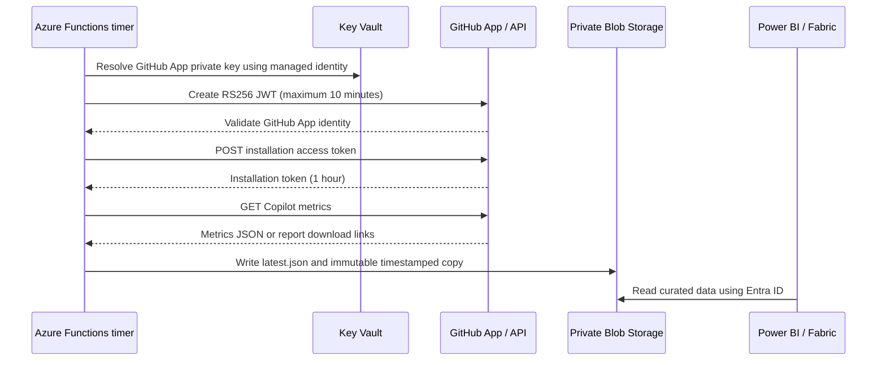

# Architecture

## Objectives

The solution separates dashboard rendering from credential handling and data collection:

1. Power BI receives JSON compatible with the official PBIX transformations.
2. GitHub credentials never need to be embedded in Power Query.
3. Azure performs authentication, collection, logging, and optional persistence.
4. The demonstration remains usable without access to a customer GitHub enterprise.
5. Production controls can be added without rebuilding the report.

## Current demonstration architecture

```mermaid
flowchart TB
    subgraph Client["Presentation"]
      PBD[Power BI Desktop]
      PBS[Power BI Service workspace]
    end

    subgraph Azure["Azure resource group"]
      WEB[Azure Functions<br/>Node.js 22]
      AI[Application Insights]
      LAW[Log Analytics]
      MI[System-assigned managed identity]
      KV[Key Vault<br/>RBAC + purge protection]
      SA[Storage Account<br/>temporary host access exemption]
    end

    JSON[GitHub Enterprise 28-day report]

    PBD -->|GET /api/metrics| WEB
    PBS -. after workspace publication .->|scheduled web refresh| WEB
    WEB --> JSON
    TIMER[Daily Timer Trigger] --> WEB
    WEB --> AI
    AI --> LAW
    WEB --> MI
    MI -. Key Vault Secrets User .-> KV
    MI -->|Storage Blob Data Contributor| SA
```

The deployment uses Azure Functions and persists `latest.json` plus timestamped history. Blob public access remains
disabled. Networking and host-storage authentication must be adapted to the target Azure landing zone.

## Target production architecture



For a production deployment in the current policy environment, add:

- A VNet integration subnet for the compute service.
- Private endpoints and private DNS for Blob and any host storage endpoints.
- Identity-based `AzureWebJobsStorage` configuration.
- A private Power BI/Fabric connectivity pattern or an approved data-serving layer.
- `PUBLIC_METRICS_ENABLED=false`.

## Components

### Backend

The TypeScript project supports two hosting models:

- Azure Functions v4 handlers in `backend/src/functions`.
- A small Node HTTP adapter in `backend/src/server.ts` retained only as an optional fallback.

Both use `backend/src/config.ts` and `backend/src/metrics.ts`.

### Data-source modes

| Mode | Input | Credentials | Public endpoint |
| --- | --- | --- | --- |
| `sample` | Packaged official sample JSON | None | Function key protected |
| `github-app` | Legacy direct metrics JSON | GitHub App installation token | Function key protected |
| `enterprise-report` | Current report index plus signed download | GitHub App installation token | Function key protected |

The application never silently changes from a real-data mode to `sample`. Missing production configuration causes an
explicit failure.

### API contracts

#### `GET /api/health`

Returns service status, hosting model, version, mode, and current UTC timestamp. It never returns resource IDs,
credentials, keys, or environment variables.

#### `GET /api/metrics`

Returns the normalized `day_totals` array from the current Enterprise report. The endpoint requires a Function key.
The legacy upstream PBIX schema differs, so the repository provides a new daily-summary Power Query.

#### `POST /api/refresh`

- Azure Functions: `authLevel=function`.
- Azure Functions requires a Function host key.
- The key is never placed in Power BI or returned by the API.

## Persistence model

The Functions implementation writes:

- `copilot-metrics/latest.json`
- `copilot-metrics/history/<UTC timestamp>.json`

`latest.json` simplifies Power BI refresh. Timestamped blobs support audit, replay, and recovery. Production retention
should be driven by privacy and reporting requirements rather than retaining data indefinitely.

## Failure behavior

- Invalid source mode: startup/request failure with a precise configuration error.
- GitHub authentication failure: error records only the HTTP status, never the JWT or token.
- Unexpected payload: rejected unless it is a JSON array.
- Storage failure: the refresh fails; production does not report success without persistence.
- Public production request: HTTP 403 when `PUBLIC_METRICS_ENABLED=false`.

## Scaling and reliability

The sample API is read-only and can be cached for five minutes. Real ingestion is intended to run once daily after
GitHub has generated the previous day's metrics. Production retry handling should honor GitHub rate-limit and
`Retry-After` headers, use exponential backoff with jitter, and avoid overlapping timer executions.
